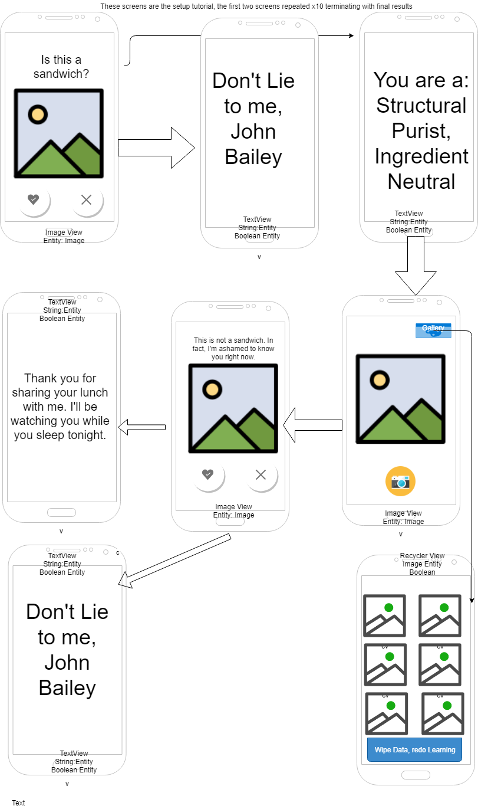

# What is a Sandwich?!

* IiaS or "Sandy" as the app is known around the globe, answers one of life's most profound existential questions: is it a sandwich?

* It's most popular among teenagers, or those with a very teenage approach to the pondering of profound perplexities.

* The app will use Facebook Sign-In as a means to access and sell your personal information (did I mention we love teenagers?). Users will then be able share their sandwiches on the social interwebs, with planned expansions of the app taking in shared images into Sandy's collective consciousness.
 
* Sandy will download with a set of 90 images that will be used upon install to learn your sandwich philosophy.For example, is a burrito a sandwich in your world? 

* According to the exhaustive research of Dr. David Nelson, there are 9 major sandwich philosophies. Ten pictures fitting each each philosophy will be downloaded, and the photos matching your type(s) will persist on the device as Sandy's initial learning. Subsequent photos captured by the user and determined to be  sandwiches will also be stored. 

* Sandy will need access to your camera and picture gallery (be sure to take a picture of your ssn for safe keeping and store it on your phone). There will be no navigation. Sandy calls the shots. You have been assimilated. She will show you 10 pictures (9 diagnostic 1 malingering test) at start and you will say yes or no to its sandwich verity. After that you will just take a picture (from within the app, the way you put your totally filtered selfie directly into Tinder) and Sandy will guess if its a sandwich or not. If she is wrong, you will be prompted to use your touch screen to circle the sandwich (this will reduce wasted space in memory when making down stream comparison). 

* You (the user, I'm sing the second peson because there's no way you won't be using this app after reading about it) will have the option of reviewing and deleting from the gallery photos stored as sandwiches. You will also have the option of wiping the data and redoing the setup tutorial (this will initiate a call through the interwebs to reinstall the initial 91 photos).

* Sandy will also employ an RNG to spit out really clever stuff, either critiquing (mocking) your taste in sandwiches or making ominous threats because she knows you're lying to her. And she always knows when you're lying... always.

* [User stories](docs/user-stories.md)

* 

